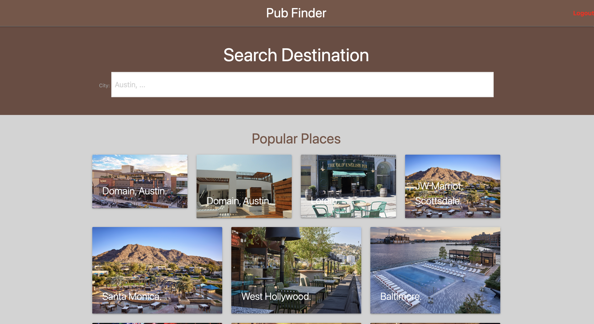

# Pub Finder 2

## Description
An app that lets users search for convenient pubs within an area, create private accounts and leaves reviews and comments on individual pubs.

[Link to deployed application on Heroku](https://)

## Table of content
* [Description](#description)
* [Installation](#installation)
* [Usage](#usage)
* [Credits](#credits)
* [License](#license)
* [Badges](#Badges)
* [Contributing](#contributing)

## Preview

## Installation
run "npm install" to install all packages at once

## Usage 

At the root of the directory, run these commands:

* mysql -u root -p (to log into mysql shell & enter your password)
* source db/schema.sql (to create the schema)
* quit;
* change the "sequelize.sync" value to "true" in the "server.js file" to drop & create tables and columns for the database.
* npm start or node server.js (to start the application's server)
* navigate to the browser and open http://localhost:3001 to run the app

OR 

* use it directly from heroku

## Credit
This app was made with love and hardwork by 
[Praise Opara](https://github.com/kingopara)

[Emilio Salazar](https://github.com/Emilio-Salazar)

[Javier Dominguez](https://github.com/JaviD17)

[Jonathan Faulkner](https://github.com/JonnyFaulkner)

## License

[MIT](https://opensource.org/licenses/MIT)

## Badges

## Contributing

